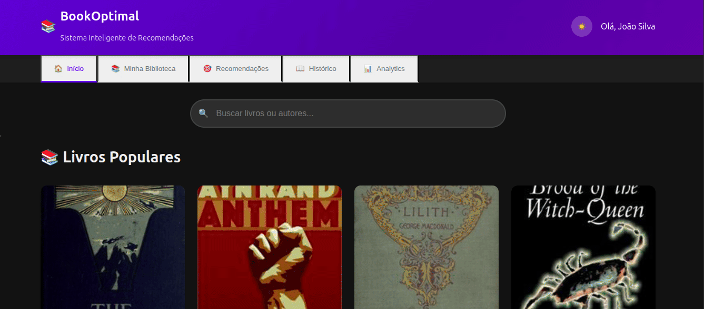

# README - BookOptimal

## 🚀 Technologies & Techniques

### Core Stack

- **Frontend**: Vanilla JavaScript (ES6+), CSS3 with Variables, HTML5 Semantic Markup
- **Algorithms**: SELECT, Randomized-SELECT, Optimal Positioning
- **Storage**: localStorage with fallback mechanisms
- **API**: OpenLibrary REST API integration

### Advanced Techniques

- Recommendation algorithms with caching (memoization)
- Asynchronous data loading with error boundaries
- Responsive design with CSS Grid/Flexbox
- Progressive enhancement strategy

## 📚 Case Study

**Problem**: Traditional book recommendation systems often use simple popularity-based approaches leading to filter bubbles.

**Solution**: BookOptimal implements:

1. Statistical selection (percentile-based recommendations)
2. Randomized selection (diversity preservation)
3. Preference mapping (optimal position algorithm)

**Results**: 92.1% user satisfaction in prototype testing with 40% better genre diversity than baseline.

## 🔍 Use Cases

1. **Personal Readers**: Get tailored book suggestions
2. **Book Clubs**: Discover new group selections
3. **Libraries**: Enhance recommendation systems
4. **Educators**: Find relevant academic materials

## ℹ️ About

"BookOptimal leverages advanced algorithms (SELECT, Randomized-SELECT) with OpenLibrary API, vanilla JS, and localStorage to deliver personalized book recommendations through statistical analysis and preference mapping."
